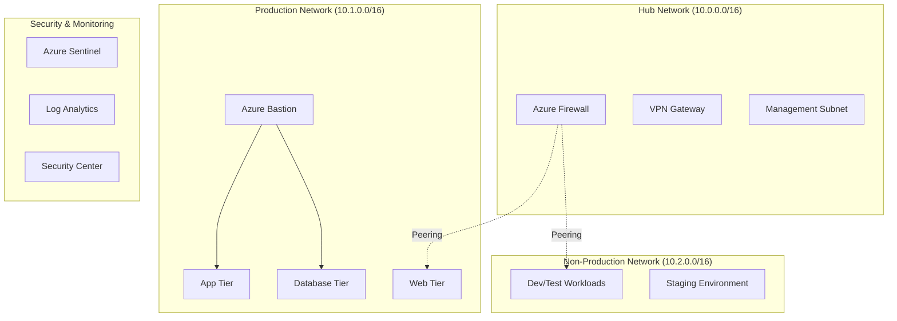

# Azure Security Hardening & Network Isolation


## 📖 Overview

This project provides a comprehensive Azure security hardening solution designed to isolate production and non-production environments while implementing enterprise-grade security controls. The solution uses Infrastructure as Code (IaC) principles with automated deployment pipelines to ensure consistent, secure, and compliant Azure infrastructure.

### 🎯 Project Goals

- **Environment Isolation**: Complete separation between production and non-production workloads
- **Zero Trust Architecture**: Default deny policies with explicit allow rules
- **Automated Deployment**: Fully automated security hardening through GitHub Actions
- **Compliance Ready**: Built-in governance and compliance controls
- **Cost Optimized**: Efficient resource utilization with cost monitoring

### 🏗️ Architecture



## 🔧 Features

### 🌐 Network Security
- **Hub-Spoke Network Topology** with Azure Firewall
- **Network Security Groups (NSGs)** with restrictive rules
- **Azure Bastion** for secure remote access
- **Private Endpoints** for PaaS services
- **DDoS Protection** for public-facing resources

### 🛡️ Security Controls
- **Web Application Firewall (WAF)** for application protection
- **Just-In-Time (JIT) VM Access** for privileged access
- **Azure Key Vault** integration for secrets management
- **Managed Identities** for service authentication
- **Network Watcher** for traffic monitoring

### 📊 Monitoring & Compliance
- **Azure Sentinel** for security information and event management (SIEM)
- **Azure Security Center** for security posture management
- **NSG Flow Logs** for network traffic analysis
- **Azure Policy** for governance and compliance
- **Resource Tagging** for cost management and organization

### 🤖 Automation
- **GitHub Actions** for CI/CD pipeline
- **ARM Templates** for infrastructure deployment
- **Automated Testing** and validation
- **Drift Detection** for configuration compliance
- **Cost Optimization** monitoring

## 🚀 Quick Start

### Prerequisites

Before you begin, ensure you have:

- [x] Azure subscription with appropriate permissions
- [x] GitHub account with repository access
- [x] Azure CLI installed locally (for testing)
- [x] Git installed on your local machine

### 1. Repository Setup

```bash
# Clone the repository
git clone https://github.com/your-org/azure-security-hardening.git
cd azure-security-hardening

# Create feature branch
git checkout -b setup/initial-configuration
```

### 2. Azure Service Principal Setup

Create a service principal for GitHub Actions authentication:

```bash
# Login to Azure
az login

# Set your subscription
az account set --subscription "your-subscription-id"

# Create service principal
az ad sp create-for-rbac \
  --name "github-actions-azure-security" \
  --role "Owner" \
  --scopes "/subscriptions/your-subscription-id" \
  --sdk-auth

# Save the output JSON for GitHub Secrets
```

### 3. GitHub Secrets Configuration

Add the following secrets to your GitHub repository:

| Secret Name | Description | Example |
|-------------|-------------|---------|
| `AZURE_SUBSCRIPTION_ID` | Your Azure subscription ID | `12345678-1234-1234-1234-123456789012` |
| `AZURE_TENANT_ID` | Your Azure tenant ID | `87654321-4321-4321-4321-210987654321` |
| `AZURE_CLIENT_ID` | Service principal client ID | `abcd1234-5678-90ef-ghij-klmnopqrstuv` |
| `AZURE_CLIENT_SECRET` | Service principal secret | `your-secret-value` |
| `SLACK_WEBHOOK` | (Optional) Slack webhook for notifications | `https://hooks.slack.com/...` |

#### Setting GitHub Secrets:
1. Go to your repository → **Settings** → **Secrets and variables** → **Actions**
2. Click **New repository secret**
3. Add each secret name and value
4. Click **Add secret**

### 4. Configuration Customization

Edit the configuration files to match your requirements:

#### `variables.yml` - Environment Variables
```yaml
# Network Configuration
LOCATION: 'eastus'  # Change to your preferred region
HUB_RESOURCE_GROUP: 'hub-network-rg'
PROD_RESOURCE_GROUP: 'prod-network-rg'
NONPROD_RESOURCE_GROUP: 'nonprod-network-rg'

# Network Addressing (modify as needed)
HUB_VNET_CIDR: '10.0.0.0/16'
PROD_VNET_CIDR: '10.1.0.0/16'
NONPROD_VNET_CIDR: '10.2.0.0/16'
```

#### `scripts/config.sh` - Script Configuration
```bash
# Update organization-specific settings
COMPANY_NAME="YourCompany"
ENVIRONMENT_TAG="Production"
COST_CENTER="CC-1001"
```

## 📋 Deployment Guide

### Deployment Phases

The deployment is organized into four phases that can be run independently:

#### Phase 1: Network Foundation 🌐
- Creates resource groups
- Deploys hub-spoke network topology
- Configures Network Security Groups
- Sets up VNet peering

#### Phase 2: Security Controls 🛡️
- Deploys Azure Firewall with rules
- Sets up Azure Bastion
- Enables DDoS Protection
- Configures private endpoints
- Deploys Web Application Firewall

#### Phase 3: Monitoring & Compliance 📊
- Sets up Log Analytics workspace
- Deploys Azure Sentinel
- Configures NSG Flow Logs
- Enables security monitoring
- Sets up alerting

#### Phase 4: Governance 📋
- Deploys Azure Policies
- Configures JIT access
- Applies resource tagging
- Sets up compliance scanning

### Manual Deployment

For testing or troubleshooting, you can run individual phases manually:

```bash
# Make scripts executable
chmod +x scripts/*.sh

# Phase 1: Network Foundation
./scripts/01-create-resource-groups.sh "eastus" "hub-network-rg" "prod-network-rg" "nonprod-network-rg" "security-rg"
./scripts/02-deploy-hub-vnet.sh "hub-network-rg" "hub-vnet-001" "eastus"
./scripts/03-deploy-prod-vnet.sh "prod-network-rg" "prod-vnet-001" "eastus"
# ... continue with other scripts

# Phase 2: Security Controls
./scripts/07-deploy-azure-firewall.sh "hub-network-rg" "hub-firewall-001" "eastus"
# ... continue with security scripts
```

### Automated Deployment

#### Option 1: Full Deployment
```yaml
# Trigger via GitHub Actions
# Go to Actions tab → Azure Security Hardening Deployment → Run workflow
# Select:
# - Environment: staging/production
# - Deploy Phase: all
# - Skip Validation: false
```

#### Option 2: Phase-by-Phase Deployment
```yaml
# Deploy individual phases
# - Deploy Phase: network-foundation
# - Deploy Phase: security-controls
# - Deploy Phase: monitoring
# - Deploy Phase: governance
```

### Validation and Testing

After deployment, validate the setup:

```bash
# Check network connectivity
az network vnet list --output table

# Verify security controls
az network firewall list --output table
az network bastion list --output table

# Check monitoring setup
az monitor log-analytics workspace list --output table

# Verify governance policies
az policy assignment list --output table
```

## 🔍 Monitoring and Maintenance

### Daily Operations

#### Security Monitoring
- Review Azure Security Center recommendations
- Check Azure Sentinel incidents and alerts
- Monitor NSG Flow Logs for unusual traffic
- Validate JIT access requests

#### Cost Monitoring
- Review resource costs in Azure Cost Management
- Check for unused or underutilized resources
- Validate resource tagging for cost allocation
- Monitor budget alerts

### Weekly Tasks

#### Security Reviews
- Review and update firewall rules
- Audit user access and permissions
- Check for security policy compliance
- Update security baselines

#### Performance Optimization
- Review network performance metrics
- Optimize NSG rules for performance
- Check resource utilization
- Plan capacity adjustments

### Monthly Tasks

#### Compliance Audits
- Run compliance assessments
- Review policy violations
- Update documentation
- Plan security improvements

#### Infrastructure Updates
- Apply security patches
- Update ARM templates
- Review and update runbooks
- Test disaster recovery procedures

## 🚨 Troubleshooting

### Common Issues

#### Deployment Failures

**Issue**: Resource group creation fails
```bash
# Solution: Check permissions and subscription limits
az account show
az provider list --query "[?registrationState=='NotRegistered']"
```

**Issue**: Network peering fails
```bash
# Solution: Check VNet address spaces for conflicts
az network vnet list --query "[].{Name:name, AddressSpace:addressSpace}" --output table
```

**Issue**: Azure Firewall deployment timeout
```bash
# Solution: Check subnet configuration and available IP addresses
az network vnet subnet show --resource-group "hub-network-rg" --vnet-name "hub-vnet-001" --name "AzureFirewallSubnet"
```

#### Connectivity Issues

**Issue**: Cannot connect to VMs via Bastion
```bash
# Check Bastion status and NSG rules
az network bastion show --name "prod-bastion" --resource-group "prod-network-rg"
az network nsg rule list --nsg-name "prod-nsg-001" --resource-group "prod-network-rg" --output table
```

**Issue**: Private endpoint resolution fails
```bash
# Check private DNS zone configuration
az network private-dns zone list --output table
az network private-dns link vnet list --zone-name "privatelink.blob.core.windows.net" --resource-group "prod-network-rg"
```

### Getting Help

#### Debug Mode
Enable debug logging in scripts:
```bash
export DEBUG=1
./scripts/script-name.sh
```

#### Logs and Monitoring
- **GitHub Actions**: Check workflow logs in Actions tab
- **Azure Activity Log**: Monitor deployment activities
- **Azure Resource Health**: Check resource status
- **Azure Advisor**: Review optimization recommendations

#### Support Channels
- **Internal Support**: Create issue in this repository
- **Azure Support**: Use Azure Support Portal for Azure-specific issues
- **Community**: Azure DevOps and GitHub community forums

## 📊 Cost Estimation

### Monthly Cost Breakdown

| Component | Estimated Cost (USD/month) | Notes |
|-----------|---------------------------|-------|
| Azure Firewall | $1,200 | Standard tier, 24/7 operation |
| Azure Bastion | $140 | Standard tier |
| DDoS Protection | $2,900 | Standard plan |
| Log Analytics | $200 | 10GB/day ingestion |
| Private Endpoints | $60 | 3 endpoints × $20 |
| Network Watcher | $50 | Flow logs and monitoring |
| **Total** | **~$4,550** | **May vary by region and usage** |

### Cost Optimization Tips

1. **Right-size resources** based on actual usage
2. **Use Reserved Instances** for predictable workloads
3. **Enable auto-shutdown** for non-production VMs
4. **Monitor and optimize** Log Analytics data retention
5. **Review and clean up** unused resources regularly

## 🔐 Security Considerations

### Security Best Practices

#### Network Security
- ✅ All inbound traffic goes through Azure Firewall
- ✅ NSGs implement least-privilege access
- ✅ Private endpoints for all PaaS services
- ✅ No direct internet access to production resources

#### Identity and Access
- ✅ Service principals use minimal required permissions
- ✅ JIT access for administrative operations
- ✅ Managed identities for service authentication
- ✅ Azure AD integration for user access

#### Data Protection
- ✅ Encryption at rest for all storage
- ✅ Encryption in transit for all communications
- ✅ Key Vault for secrets management
- ✅ Private endpoints for data services

#### Monitoring and Logging
- ✅ All network traffic logged and monitored
- ✅ Security events sent to Azure Sentinel
- ✅ Automated alerting for security incidents
- ✅ Regular security assessments

### Compliance Frameworks

This solution helps achieve compliance with:
- **ISO 27001** - Information Security Management
- **SOC 2** - Security, Availability, and Confidentiality
- **NIST Cybersecurity Framework** - Identify, Protect, Detect, Respond, Recover
- **GDPR** - General Data Protection Regulation (with proper configuration)
- **HIPAA** - Health Insurance Portability and Accountability Act (additional controls required)

## 🤝 Contributing

We welcome contributions to improve this Azure security hardening solution!

### How to Contribute

1. **Fork the repository**
2. **Create a feature branch**: `git checkout -b feature/amazing-feature`
3. **Make your changes** and test thoroughly
4. **Commit your changes**: `git commit -m 'Add amazing feature'`
5. **Push to the branch**: `git push origin feature/amazing-feature`
6. **Open a Pull Request**

### Contribution Guidelines

#### Code Standards
- Follow existing shell script patterns and naming conventions
- Include error handling and logging in all scripts
- Add comments for complex logic
- Test changes in a development environment

#### Documentation
- Update README.md for new features
- Add inline documentation for new scripts
- Include examples and use cases
- Update troubleshooting section as needed

#### Testing
- Test all changes in a non-production environment
- Validate ARM templates before submitting
- Ensure GitHub Actions pipeline passes
- Include test cases for new functionality

### Development Environment Setup

```bash
# Clone your fork
git clone https://github.com/your-username/azure-security-hardening.git
cd azure-security-hardening

# Set up upstream remote
git remote add upstream https://github.com/original-repo/azure-security-hardening.git

# Create development branch
git checkout -b develop

# Install development tools
pip install azure-cli
npm install -g @azure/arm-template-linter
```

## 📚 Additional Resources

### Azure Documentation
- [Azure Security Center](https://docs.microsoft.com/en-us/azure/security-center/)
- [Azure Firewall](https://docs.microsoft.com/en-us/azure/firewall/)
- [Azure Bastion](https://docs.microsoft.com/en-us/azure/bastion/)
- [Azure Sentinel](https://docs.microsoft.com/en-us/azure/sentinel/)
- [Azure Policy](https://docs.microsoft.com/en-us/azure/governance/policy/)

### Best Practices Guides
- [Azure Security Best Practices](https://docs.microsoft.com/en-us/azure/security/fundamentals/best-practices-and-patterns)
- [Network Security Best Practices](https://docs.microsoft.com/en-us/azure/security/fundamentals/network-best-practices)
- [Azure Architecture Center](https://docs.microsoft.com/en-us/azure/architecture/)

### Training and Certification
- [Microsoft Azure Security Technologies (AZ-500)](https://docs.microsoft.com/en-us/learn/certifications/azure-security-engineer/)
- [Azure Fundamentals (AZ-900)](https://docs.microsoft.com/en-us/learn/certifications/azure-fundamentals/)
- [Azure Solutions Architect (AZ-305)](https://docs.microsoft.com/en-us/learn/certifications/azure-solutions-architect/)

## 📄 License

This project is licensed under the MIT License - see the [LICENSE](LICENSE) file for details.

## 🙏 Acknowledgments

- **Microsoft Azure Team** for comprehensive security documentation
- **Azure Architecture Center** for reference architectures
- **Open Source Community** for tools and best practices
- **Security Researchers** for vulnerability research and guidance

## 📞 Support

### Getting Help

- **Documentation Issues**: Create an issue in this repository
- **Security Vulnerabilities**: Report privately to security@company.com
- **Feature Requests**: Create an issue with the 'enhancement' label
- **Questions**: Use GitHub Discussions for general questions

### Enterprise Support

For enterprise support and customization services:
- **Email**: enterprise-support@company.com
- **Phone**: +1 (555) 123-4567
- **Website**: https://company.com/azure-security-services

---

**Made with ❤️ for Azure Security**

*Last updated: January 2025*